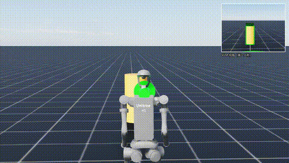
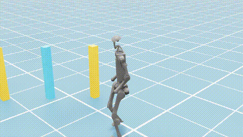

# H1 Humanoid Obstacle Avoidance

面向人形机器人运动控制与具身智能：基于 RSL-RL (PPO) 训练 Unitree H1 行走策略，构建 YOLO 视觉感知 + VLM 语言决策 + RL 运动执行的分层 VLA 避障闭环，并用 C++ / ROS2 完成策略部署与验证。

`C++` `ROS2` `RSL-RL (PPO)` `VLA` `YOLO` `VLM` `Python` `Isaac Sim` `Isaac Lab` `ONNX Runtime`

## 主要工作

1. **训练 H1 行走策略**
   用 RSL-RL (PPO) 在 Isaac Lab 训练 H1 人形机器人行走策略（观测 69 维 → 动作 19 维），导出 ONNX，Sim2Sim 验证 ONNX 与 PyTorch 输出一致，最大误差 < 1e-4。

2. **搭建分层 VLA 避障闭环**
   构建"YOLO 视觉感知 → Qwen2-VL 语言决策 → RL 策略执行 → 回正归位"的分层 VLA 闭环。YOLO 障碍检测 mAP50 ≈ 0.995，Qwen2-VL 4bit 量化推理；双相机 + 画中画直观呈现"机器人看到了什么、如何决策"。

3. **用 C++ / ROS2 完成策略部署**
   编写 C++ 部署节点，ONNX Runtime 推理：订阅 joint_states / IMU / cmd_vel，构造 69 维观测，输出 19 维关节位置目标，完成 ROS2 架构下的策略部署闭环。

## Demo

**避障闭环**



**直行**



## 项目结构

```text
training/                    RL 训练与导出
deploy_ros2/                 WSL2 ROS2 部署
    src/policy_node.cpp      C++ 推理节点
    h1_joints.json           部署契约（观测/动作定义）
    sim/h1_sim.py            H1 仿真器（ROS2）
    sim/run_sim.sh           启动脚本
render/render.py             行走日志 → 渲染视频
vla/                         VLA 避障闭环
    vla_demo.py              分层 VLA demo
    record.py                录轨迹
    replay.py                重放出片
    run.sh                   黑帧重试启动
    yolo/                    YOLO 采集/标注/训练
assets/                      模型 / 数据集 / Demo 视频
docs/                        环境搭建 / 部署 / 总结
```

## Quick Start

```bash
# 安装依赖（Isaac Sim / Isaac Lab 按 docs/环境搭建.md）
pip install -r requirements.txt

# 跑 VLA 闭环 demo（VLM 首次运行自动下载，需先登录 HF）
huggingface-cli login
python vla/vla_demo.py
```

部署（WSL2）见 `deploy_ros2/README.md`。

## Motivation

承接[动态避障与轨迹规划方向的研究课题](https://github.com/Charie-0617/flexible-manipulator-obstacle-avoidance)，把机械臂上验证过的方法迁移到人形机器人：RL 训练运动控制，分层 VLA 完成感知与决策避障。目的是验证这套方法在人形平台上的可行性，作为具身智能竞赛的作品基础，并为后续向人形机器人真机部署（Sim2Real）铺路。

## License

[MIT](LICENSE)
